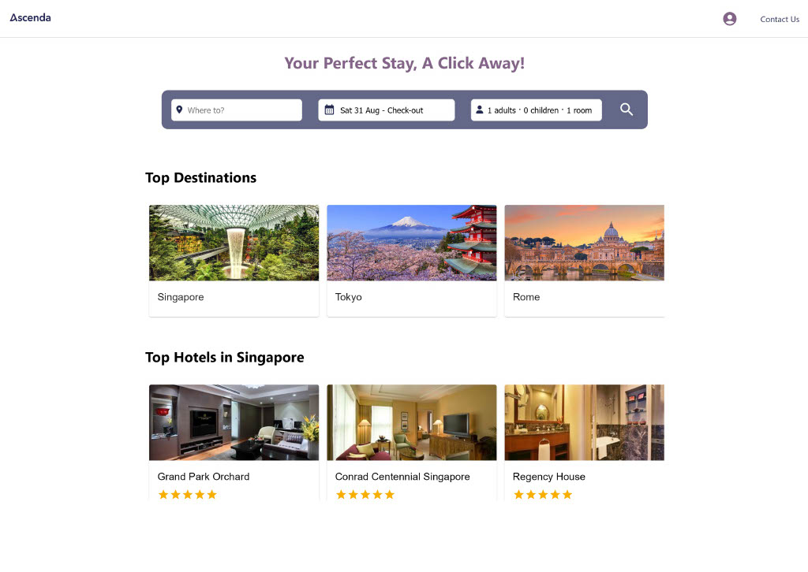
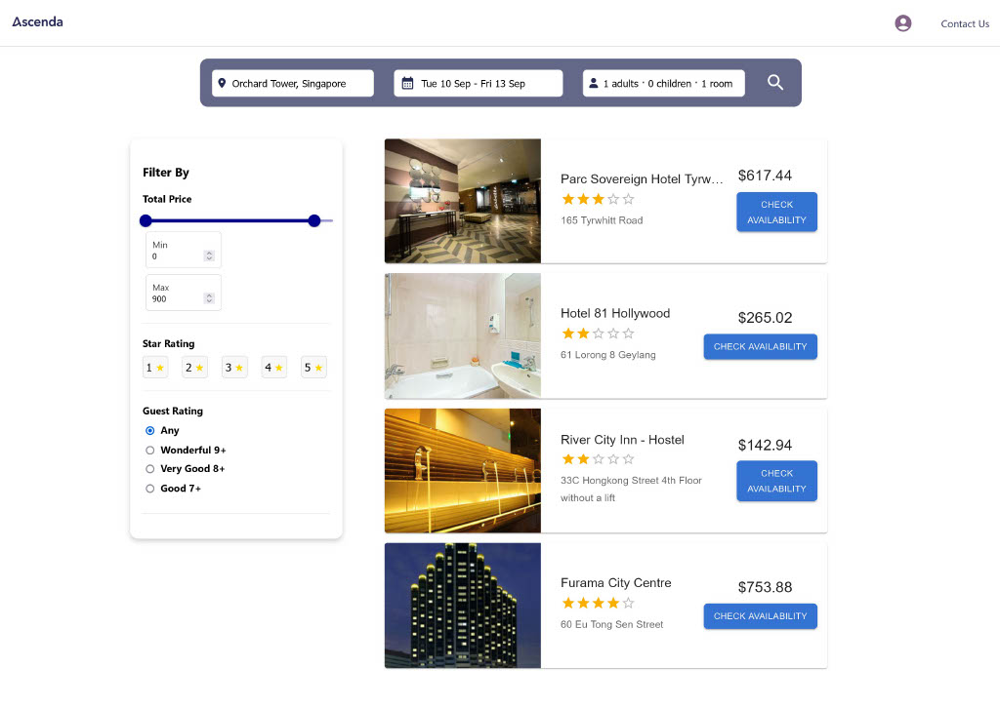
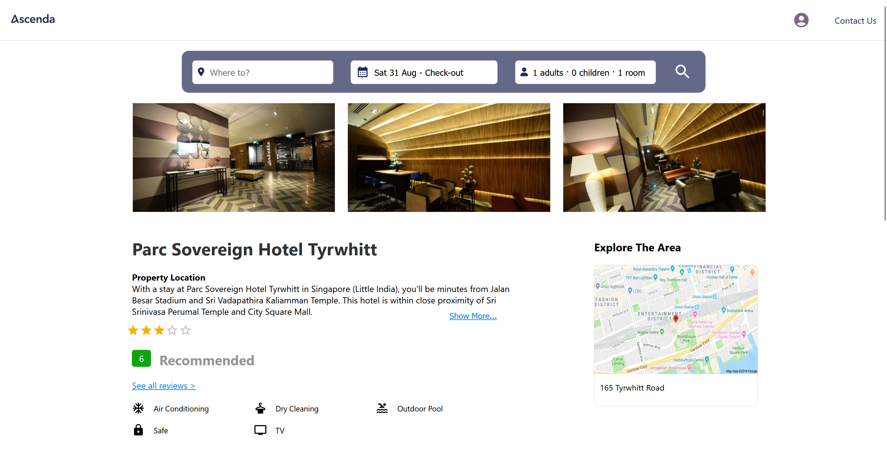

# TripLodge - Hotel Booking Systen

[](https://github.com/Jungstershark/TripLodge "Go to GitHub repo")
[](https://github.com/Jungstershark/TripLodge)
[](https://github.com/Jungstershark/TripLodge)
[](LICENSE)
[](https://github.com/Jungstershark/TripLodge/actions)
[](https://github.com/Jungstershark/TripLodge/issues)

<div align="center">
    
</div>

## Overview
TripLodge is a scalable hotel booking system developed as part of a project at the Singapore University of Technology and Design (SUTD) in collaboration with industry partner Ascenda. The system enables users to efficiently search, book, and manage hotel reservations using a robust architecture that integrates with external APIs for real-time hotel listings and secure payment processing.


Built using modern web technologies, TripLodge emphasizes performance, security, and user experience. Key features include API integration with Ascenda’s Hotel API, Stripe payment gateway, and implementation of caching mechanisms and front-end pagination to optimize load times. The system is designed to be inclusive and accessible, supporting various user demographics.


## Features

- **Hotel Search:** Users can perform detailed searches for hotels by destination, dates, guests, and rooms, with advanced filtering options like star ratings, guest ratings, and price range.
- **Booking and Payment:** Secure hotel bookings are facilitated through an integration with Stripe. Logged-in users benefit from auto-filled forms based on stored account data.
- **User Account Management:** Features include user registration, login, and account management with options to update personal details and view booking history.
- **Integration with External APIs:* Real-time hotel listings and transactions are handled through integration with Ascenda’s Hotel API and Stripe payment gateway.
- **Performance Optimization:** The system utilizes caching for frequently searched destinations and front-end pagination to improve responsiveness and user experience.
- **Testing and Robustness:** Comprehensive testing, including unit, integration, and fuzz testing, ensures the system's stability and resilience against unexpected inputs.

## Installation

To set up and run the TripLodge system locally, follow these steps:

### Prerequisites

- Operating System: Windows 10 or later
- Node.js (v14.x or later)
- npm (v6.x or later)
- MySQL (v8.x or later)
- Git (for cloning the repository)

### Clone the Repository

```bash
git clone https://github.com/yourusername/TripLodge.git
cd TripLodge
```

### Install Dependencies

Navigate to both the server and client directories and install the required dependencies:
```bash
# Install server dependencies
cd server
npm install

# Install client dependencies
cd ../client
npm install
```

### Set Up Environment Variables

Create a .env file in the server directory using the .env.example and add the necessary environment variables:

```txt
PORT= 5000

# Database server configuration
DB_HOST=your_database_host
DB_USER=your_database_user
DB_PASSWORD=your_database_password
DB_NAME=your_database_name
JWT_SECRET=any_string

# Email Server configuration
MAIL_USER=your email
MAIL_PW=your_email_pw

# Stripe
STRIPE_SECRET_KEY=your_stripe_test_key
CLIENT_URL=http://localhost:3000
```

### Database Setup
#### Install MySQL on Windows
1. **Download MySQL Installer:** Go to the MySQL website and download the MySQL Installer for Windows.
2. **Run the Installer:** Open the downloaded file and follow the installation steps. Choose the Custom installation type to select the components you need (e.g., MySQL Server, MySQL Workbench).
3. **Configure MySQL Server:** During installation, configure the MySQL server. Set the root password and note it down as it will be required later. Optionally, create a new MySQL user with full privileges if you prefer not to use the root account.
4. **Start MySQL Workbench:** After installation, you can start MySQL Workbench to manage your databases.

#### Create Database
1. **Log in to MySQL:** Open MySQL Workbench and log in with the root user (or another user with sufficient privileges).
2. **Create a New Database:** Run the following SQL command to create a new database:
```MySQL
CREATE DATABASE tripLodgeDB;
```
3. **Update the .env File:** Make sure the .env file in the server directory contains the correct database connection details, including the DB_HOST, DB_USER, DB_PASSWORD, and DB_NAME.

### Run the Application

Start both the server and the client:
```bash
# Start the server
cd ../server
npm start

# Start the client
cd ../client
npm start
```

### Access the Application

Once the client and server are running, you can access the application by navigating to http://localhost:3000 in your browser.

## 5. Usage

After setting up the system, you can:

1. **Search Hotels:** Enter a destination, select dates, and apply filters to search for available hotels.

<div align="center">
    
</div>

2. **Book Hotels:** Select a hotel, provide booking details, and make a payment through the integrated Stripe gateway.

<div align="center">
    
</div>

3. **User Account:** Register, log in, and manage your account details, including saved bookings and payment information.
<div align="center">
    
</div>

## Testing

The system includes extensive testing for both the backend and frontend components.

### Running Unit Tests

Unit tests are located in the server/tests and client/tests directories. To run the tests:

```bash
# Run backend tests
cd server
npm test

# Run frontend tests
cd ../client
npm test
```

### Running Integration and System Tests

Integration tests are primarily for backend routes and controllers. System tests use Cypress and are focused on end-to-end scenarios.

```bash
# Run Cypress tests (ensure the server is running)
cd ../client
npm run cypress:open
```

## License

This project is licensed under the MIT License - see the LICENSE file for details.

## Credits

Ong Jung Yi, Luvyn Sequeira, Stavya Sharma, Zhuang Yang Kun, Yee Jia Zhen, Lee Jun Hui Ryan, Luong Hung


